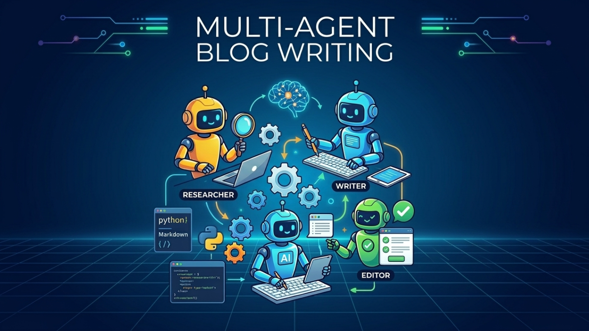

# ai-content-engine

Blog writing often gets stuck across too many disconnected steps. A rough idea needs a brief, the brief needs research, the research needs an outline, the outline needs a draft, and the draft usually needs revision before it is usable. This open-source project gives you one guided workflow for moving from idea to draft without losing structure or source grounding.



## Why This Project

This project helps you:
- Turn a vague content idea into a usable brief.
- Research the topic before writing.
- Build a structured outline instead of jumping straight to drafting.
- Generate and revise drafts through a chat-style workflow.
- Keep the whole process local and hackable.

## Prerequisites

- Python 3.11+
- Node.js 18+
- npm
- Docker and Docker Compose, if you want to run the full stack in containers
- An `OPENAI_API_KEY`
- An `OLOSTEP_API_KEY` if you want research tools such as web search and scraping to work

## Quick Start

Create a `.env` file in the project root:

```env
OPENAI_API_KEY=your_openai_api_key_here
OLOSTEP_API_KEY=your_olostep_api_key_here
OPENAI_MODEL=gpt-4.1-mini
LOG_LEVEL=INFO
```

Install backend dependencies:

```bash
pip install -r requirements.txt
```

Start the backend:

```bash
uvicorn blog_agent.main:app --reload --host 0.0.0.0 --port 8000
```

In a second terminal, install frontend dependencies:

```bash
cd frontend
npm install
```

Start the frontend:

```bash
npm run dev
```

Open the local URL printed by Vite, usually:

```text
http://localhost:5173
```

Or run the full stack with Docker Compose:

```bash
docker compose up --build
```

## What It Does

For each blog workflow, the app:
1. Collects the blog brief through a chat-style interaction.
2. Uses the brief to generate an outline.
3. Lets you review or approve the outline before drafting continues.
4. Drafts the article with source-aware research when needed.
5. Supports revision cycles for both outline and draft.
6. Streams live updates to the frontend during the workflow.

## Run Modes

Choose one of these ways to run the project:

- Local development:
  - Backend: `uvicorn blog_agent.main:app --reload --host 0.0.0.0 --port 8000`
  - Frontend: `cd frontend && npm run dev`
  - The frontend connects to the backend WebSocket at `ws://127.0.0.1:8000` by default.
- Docker Compose:
  - `docker compose up --build`
  - Frontend: `http://localhost:3000`
  - Backend health check: `http://localhost:8000/health`
  - Docker Compose reads environment variables from the root `.env` file.

## Project Structure

```text
blog_agent/   Backend workflow, prompts, models, tools, and WebSocket server
frontend/     React + Vite frontend
Dockerfile    Backend container image
docker-compose.yml
```
